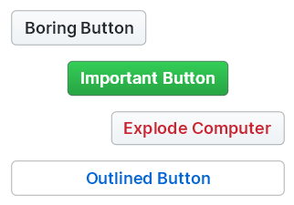

# Thunderclap

A Rust toolkit to write decomposable and fast user interfaces. It is:

- **Event-driven:** Thunderclap builds efficient abstractions over the Reclutch event system to avoid unnecessary computations.
- **Simple:** Thunderclap provides a suite of widgets alongside various infrastructures to simplify writing your own widgets.
- **Customizable:** There isn't a single line of hard-coded widget rendering; trivial widgets are fully parameterized and non-trivial widgets delegate to a provided theme.



## Overview

Thunderclap aims to take the traditional widget hierarchy model from bulletproof libraries (e.g. Qt) and combine it with the cutting-edge simplicity of modern toolkits (e.g. Flutter).
To accomplish this it provides three primary high-level components:

- A widget library that fills the need for boilerplate UI components.
- A theme API with a verbose typography and color scheme protocol.
- A macro to emulate a declarative UI syntax for widget creation.

The high-level UI code semantics are identical to that of XAML's.
This implies several features;

- Widgets that are explicitly given a name map to fields of the widget type (`x:Name="name"` becomes `as name`, then `self.name`).
- Widget properties can be optionally set, falling back to a default value (`property="value"` becomes `property=value`).
- Binding to events is done directly in the high-level syntax (`Event="handler"`becomes `@event { handler }`).

The biggest difference is that XAML is stored in an external file, however Thunderclap parses input from a macro directly in code.

## Example

There's also [an in-depth overview of the code below](https://github.com/jazzfool/thunderclap/wiki/Making-a-counter).

```rust
use thunderclap::{
    app, base,
    themes::Primer,
    ui::{Button, Label, VStack},
};

rooftop! {
    struct Counter: () {
        fn build(
            count: i32 = 0,
        ) {
            VStack() {
                Label(
                    text=bind(format!("Count: {}", bind.count).into()),
                    wrap=false,
                ),
                Button(text="Count Up")
                    @press {
                        widget.data.count += 1;
                    },
                Button(text="Count Down")
                    @press {
                        widget.data.count -= 1;
                    },
            }
        }
    }
}

fn main() {
    let app = app::create(
        |_, display| Primer::new(display).unwrap(), // theme
        |u_aux, g_aux, theme| {
            Counter {
                // Perhaps we want to start counting from 5 instead of 0
                count: 5,
                ..Counter::from_theme(theme)
            }.construct(theme, u_aux, g_aux)
        },
        app::AppOptions {
            name: "Counter App".into(),
            ..Default::default()
        },
    ).unwrap();
    app.start(|_| None);
}
```

---

### You can see a rundown of all the widgets [here](Widgets.md).

## Theme List (so far)

- GitHub Primer

## Widget List (so far)

- Button
- Vertical Stack
- Container
- Label
- Checkbox
- Horizontal Stack
- Text area
- Margins
- Max Fill

## Project State

I'm currently very busy with my studies and don't have much free time to work on this.
I've made a lot of careless core design decisions in the API that I'm in the process of fixing, but it's difficult given that I've already written a lot of high-level widget code.
On an optimistic note, looking past some of the admittedly ugly macro/`base` code, the front-facing API is, in my opinion, one of the more intuitive ones compared to other Rust GUI libraries.
Once I fix the issues in the foundational code (which I'm approaching the end of refactoring), I can start working on the high-level widget library again. I don't plan on this project dying.

## License

Thunderclap is licensed under either

- [Apache 2.0](https://www.apache.org/licenses/LICENSE-2.0)
- [MIT](http://opensource.org/licenses/MIT)

at your choosing.
